# Introdução

Informações básicas do projeto.

- **Projeto:** DivulgaHub
- **Repositório GitHub:** https://github.com/ICEI-PUC-Minas-PMGES-TI/pmg-es-2025-1-ti1-2401100-prisma
- **Membros da equipe:**

  - [Arthur Argemiro Júlio](https://github.com/ArthurJulio1106)
  - [Arthur Chaves Viana Leão](https://github.com/arthurcvl)
  - [João Heleno](https://github.com/JoaoVHeleno)
  - [João Vitor Tolentino](https://github.com/tolentino77)
  - [Jonas Lopes Ferreira Pedrosa](https://github.com/JPedrosa16)
  - [Lucas Eduardo Almeida dos Santos](https://github.com/lucassts5)
  - [Mateus de Moura Armani](https://github.com/mateusarmanii)
  - [Pedro Rocha Resende](https://github.com/pedroresendedev)
  - [William Augusto Lobo Freire](https://github.com/WillDarkkj)

A documentação do projeto é estruturada da seguinte forma:

1. Introdução
2. Contexto
3. Product Discovery
4. Product Design
5. Metodologia
6. Solução
7. Referências Bibliográficas

✅ [Documentação de Design Thinking (MIRO)](files/MIRO_Prisma_DivulgaHub.pdf)

# Contexto

O DivulgaHub é uma plataforma web desenvolvida para facilitar a divulgação de eventos artísticos voltados a públicos diversos, promovendo o acesso democrático à cultura. A proposta é conectar artistas, público, patrocinadores e influenciadores locais, criando um ecossistema colaborativo e acessível.

## Problema

A problematica principal se trata da divulgação eficiente de eventos ser comprometida por barreiras como o acesso restrito a eventos gratuitos e de alta qualidade, a escassez de recursos financeiros para marketing cultural, a baixa visibilidade em redes sociais, as dificuldades em identificar influenciadores locais segmentados e a prevalência de inúmeros eventos que passam despercebidos.

## Objetivos

O DivulgaHub tem como objetivo ser uma plataforma digital projetada para centralizar e simplificar o acesso a todos os eventos realizados no Brasil. Com o objetivo de fortalecer a conexão entre organizadores e o público, o site oferece informações atualizadas e abrangentes sobre eventos culturais, esportivos, sociais e corporativos, possibilitando que os usuários descubram facilmente as atrações disponíveis na cidade. Com uma interface intuitiva e de fácil navegação, o DivulgaHub se posiciona como o parceiro ideal para aproveitar ao máximo a programação local, promovendo uma experiência enriquecedora e conectada à vida cultural da região.

## Justificativa

A justificativa para o desenvolvimento do DivulgaHub é fundamentada em pesquisas que evidenciam uma concorrência acirrada, a ausência de recursos para divulgação profissional, a ineficácia de canais de comunicação tradicionais e uma segmentação inadequada do público, resultando em muitos eventos que, apesar de alocar a maior parte dos recursos à divulgação, não alcançam o público desejado, além das dificuldades em conquistar patrocínios, o que reforça a importância de uma plataforma centralizada e integrada.

## Público-Alvo

- Frequentadores de Eventos: Buscam filtrar eventos por categoria e localização, com a finalidade de encontrar aquele que mais tem afinidade em sua região.
- Organizadores de Eventos: Querem cadastrar e divulgar eventos em sua região sem ter um custo de divulgação elevado.
- Artistas Independentes: Desejam promover apresentações ao grande público de forma efetiva e com baixo custo.

# Product Discovery

## Etapa de Entendimento

Nessa etapa, trabalhamos com a metdologia de Design Thinking para compreender com maior profundidade o problema a ser tratado. Nesse processo, vamos elaborar:

- Matriz CSD: também conhecida por Matriz de Alinhamento, é uma ferramenta utilizada no Design Thinking para organizar informações e facilitar o processo de tomada de decisão e solução de problemas;
- Mapa de stakeholders: ferramenta que nos permite compreender o grupo de pessoas e entidades que devemos estudar e conversar para entender mais sobre o problema
- Entrevistas qualitativas: série de entrevistas qualitativas para validar suposições e solucionar as dúvidas com as principais pessoas envolvidas;
- Highlights de pesquisa: um compilado do levantamento realizado por meio das entrevistas.

## Etapa de Definição

### Personas

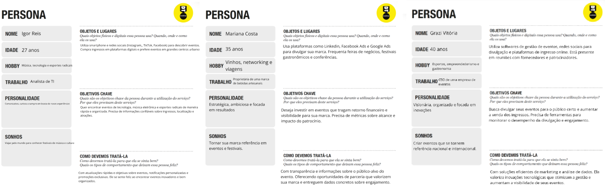

# Product Design

Nesse momento, vamos transformar os insights e validações obtidos em soluções tangíveis e utilizáveis. Essa fase envolve a definição de uma proposta de valor, detalhando a prioridade de cada ideia e a consequente criação de wireframes, mockups e protótipos de alta fidelidade, que detalham a interface e a experiência do usuário.

## Histórias de Usuários

Com base na análise das personas foram identificadas as seguintes histórias de usuários:

| Eu como...                                     | Quero/Preciso...                                                                 | Para...                                                                                |
| ---------------------------------------------- | -------------------------------------------------------------------------------- | -------------------------------------------------------------------------------------- |
| Frequentador de eventos                        | visualizar uma lista de eventos filtrada por categoria e localização             | encontrar eventos que me interessam de forma rápida e prática                          |
| Patrocinadora – Empresária do Setor de Bebidas | acessar informações sobre o público e alcance dos eventos                        | decidir em quais eventos vale a pena investir e garantir visibilidade para minha marca |
| Organizador de eventos                         | cadastrar e divulgar meus eventos de forma intuitiva na plataforma               | alcançar um público maior e aumentar a visibilidade do meu evento                      |
| Artista Independente – Cantor e Compositor     | divulgar minhas apresentações na plataforma                                      | atrair mais público e ser descoberto por organizadores e patrocinadores                |
| Frequentador de eventos                        | receber notificações sobre eventos próximos que correspondam aos meus interesses | não perder oportunidades de participar de eventos que gosto                            |
| Influenciadora Digital                         | compartilhar eventos diretamente nas minhas redes sociais pela plataforma        | engajar meu público e aumentar minha relevância no nicho de eventos                    |
| Dono de casa de shows                          | acompanhar as reservas e lotação dos meus eventos em tempo real                  | otimizar a organização e garantir uma experiência melhor para o público                |
| Produtora Cultural                             | analisar dados de público e tendências de eventos anteriores                     | planejar melhor futuros eventos e maximizar a participação do público                  |

## Proposta de Valor

Proposta para Persona Igor Reis

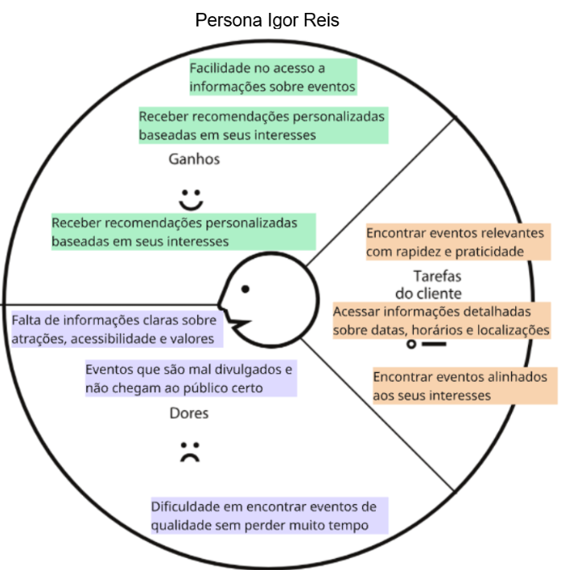

Proposta para Persona Bruna Martins

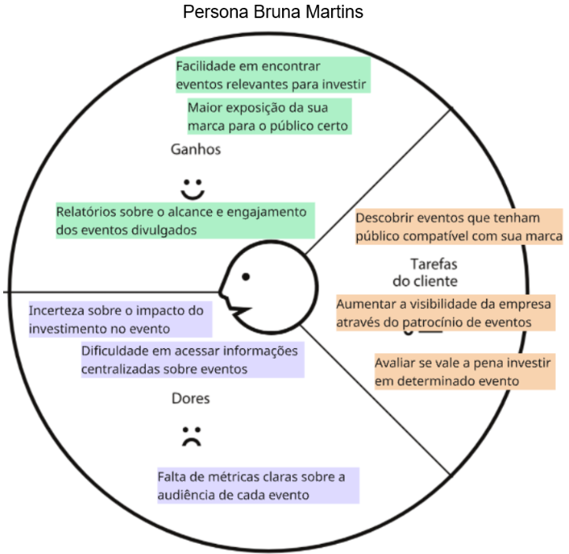

Proposta para Persona Igor Reis

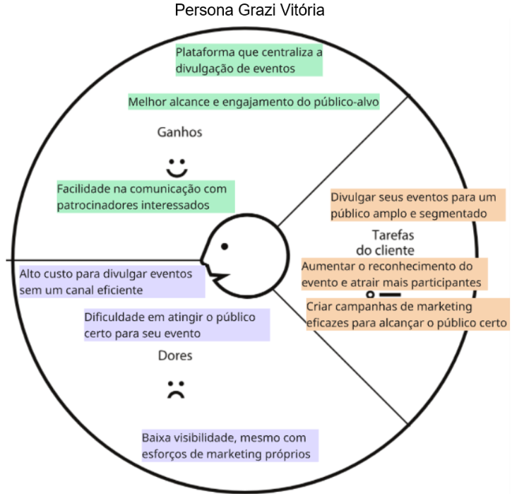

## Requisitos

As tabelas que se seguem apresentam os requisitos funcionais e não funcionais que detalham o escopo do projeto.

### Requisitos Funcionais

| ID     | Descrição do Requisito                                                                                                   | Prioridade |
| ------ | ------------------------------------------------------------------------------------------------------------------------ | ---------- |
| RF-001 | O site deve permitir login e registro de usuário                                                                         | Média      |
| RF-002 | O site deve ter uma ferramenta de busca de eventos com base em nome, data, categoria ou localização                      | Média      |
| RF-003 | O site deve permitir que os organizadores cadastrem evento                                                               | Alta       |
| RF-004 | O site deve exibir a localização do evento em um mapa                                                                    | Média      |
| RF-005 | O site deve permitir que os participantes deixem comentários e avaliações sobre os eventos                               | Média      |
| RF-006 | O site deve permitir salvar notícias preferidas                                                                          | Baixa      |
| RF-007 | O sistema deve fornecer informações para os organizadores dos eventos, como: número de inscrições, acessos e engajamento | Alta       |
| RF-008 | O site deve exibir uma página detalhada para cada evento, contendo todas as informações relevantes                       | Alta       |
| RF-009 | O site deve permitir o envio de notificações aos usuários sobre eventos de interesse                                     | Média      |
| RF-010 | O site deve oferecer integração com redes sociais para compartilhamento de eventos                                       | Baixa      |

### Requisitos não Funcionais

| ID      | Descrição do Requisito                                                                             | Prioridade |
| ------- | -------------------------------------------------------------------------------------------------- | ---------- |
| RNF-001 | O site deve ser responsivo, para que os usuarios possam o acessar de diversos tipos de dispositivo | Alta       |
| RNF-002 | O site deve ser facil de usar para os usuarios e organizadores de evento                           | Alta       |

## Projeto de Interface

Artefatos relacionados com a interface e a interacão do usuário na proposta de solução.

### Wireframes

Cadastro de Usuário

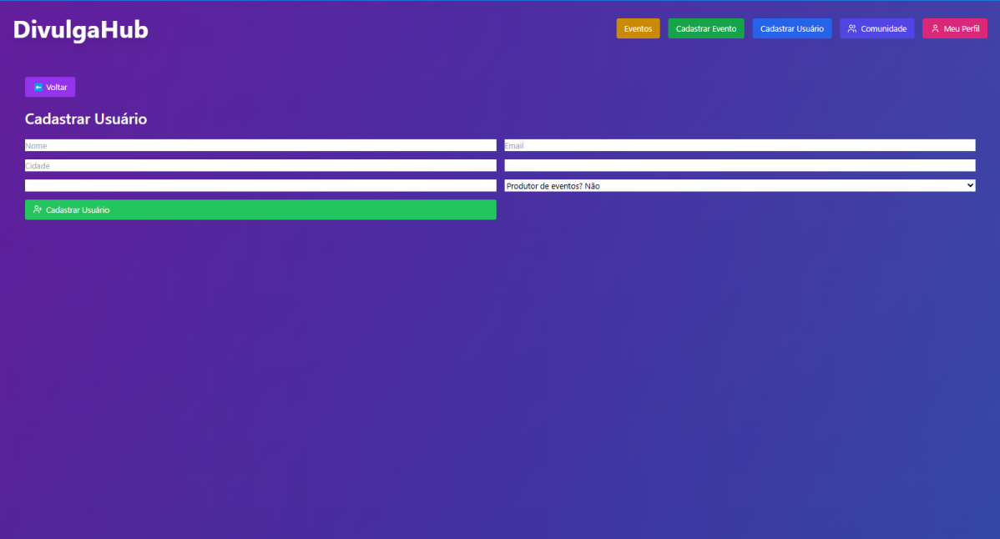

Perfil do Usuário

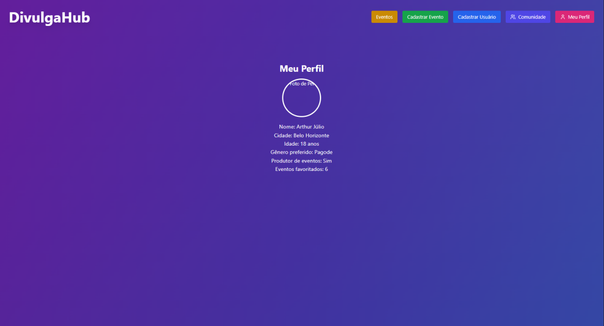

Cadastro de evento

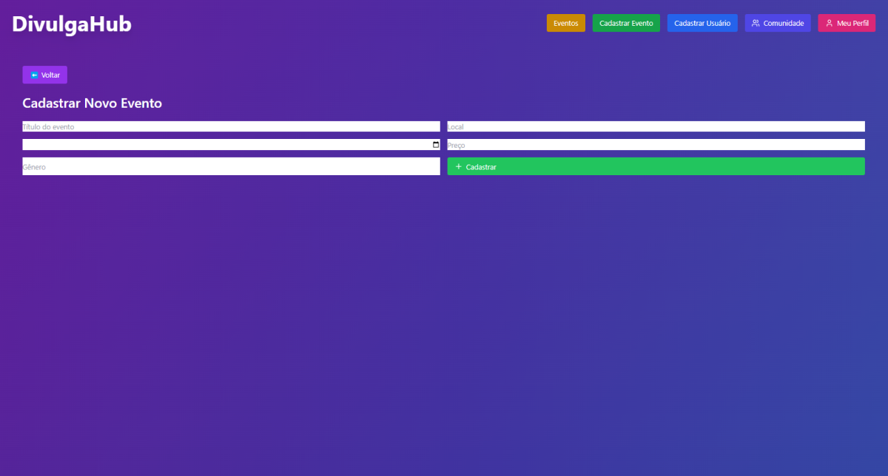

Detalhes de evento

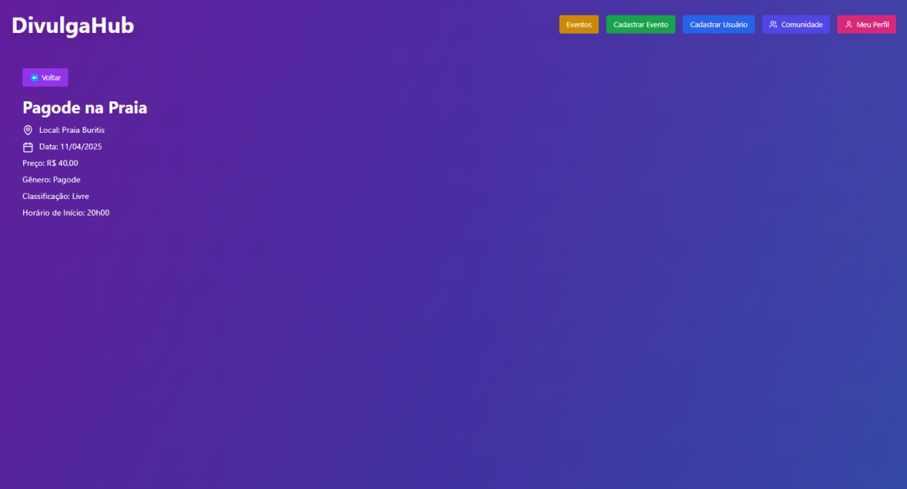

Cards de eventos

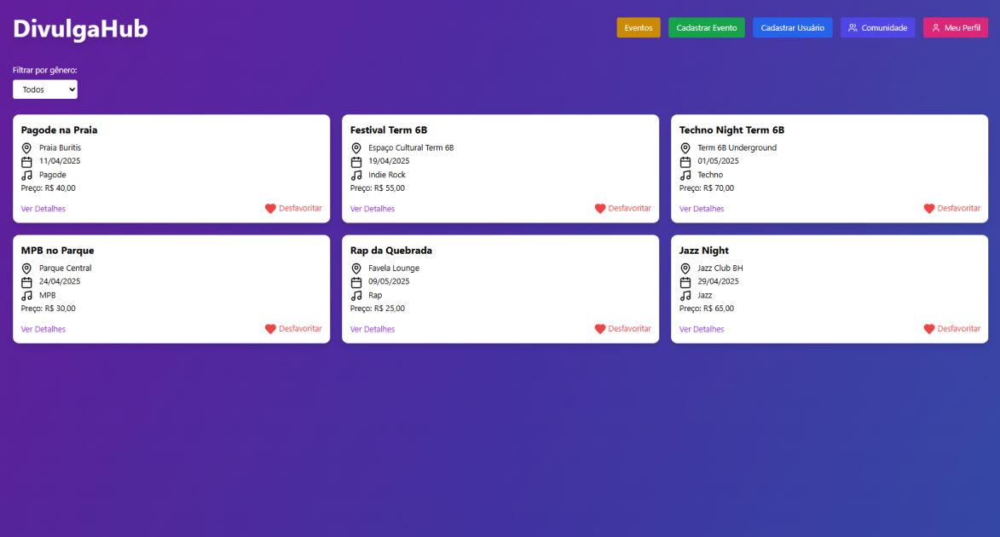

### User Flow


<!-- ### Protótipo Interativo

**✳️✳️✳️ COLOQUE AQUI UM IFRAME COM SEU PROTÓTIPO INTERATIVO ✳️✳️✳️**

✅ [Protótipo Interativo (MarvelApp)](https://marvelapp.com/prototype/4hd6091?emb=1&iosapp=false&frameless=false) ⚠️ EXEMPLO ⚠️

> ⚠️ **APAGUE ESSA PARTE ANTES DE ENTREGAR SEU TRABALHO**
>
> Um protótipo interativo apresenta o projeto de interfaces e permite ao usuário navegar pelas funcionalidades como se estivesse lidando com o software pronto. Utilize as mesmas ferramentas de construção de wireframes para montagem do seu protótipo interativo. Inclua o link para o protótipo interativo do projeto. -->

# Metodologia

A metodologia de trabalho do DivulgaHub foi estruturada em um processo ágil, dividido em sprints, com atribuições claras e o uso de ferramentas colaborativas para garantir a eficiência e a qualidade do desenvolvimento. O processo foi organizado em etapas específicas, onde cada membro da equipe assumiu responsabilidades alinhadas às suas competências, promovendo uma divisão de tarefas que otimiza o progresso do projeto.

As atribuições foram distribuídas da seguinte forma:

João Heleno é responsável pela Pesquisa de Eventos, coletando dados e insights sobre o cenário local;

João Tolentino cuida do Cadastro de Usuário, desenvolvendo a funcionalidade de registro;

Arthur Julio lidera o Cadastro de Artista, focando na inclusão de perfis de artistas;

William gerencia a Exibição de Eventos, assegurando a visualização dos eventos na interface;

Lucas Eduardo desenvolve os Detalhes de Eventos, criando páginas interativas para informações detalhadas;

Matheus Armani implementa o Cadastro de Eventos, permitindo a criação de novos eventos;

Pedro Rocha trabalha no Mapa de Eventos, integrando uma visualização geográfica;

Arthur Chaves gerencia o Cadastro de Promotor, facilitando a inscrição de patrocinadores;

Jonas Pedrosa é responsável pelos Detalhes dos Artistas, detalhando os perfis de artistas na plataforma

## Ferramentas

Para suportar esse fluxo de trabalho, a equipe utilizou ferramentas como:
Trello para gerenciar tarefas e acompanhar o progresso das sprints;
Figma para o design de wireframes e protótipos;
Git para controle de versão e colaboração no código, assegurando uma metodologia integrada e adaptável às necessidades do projeto

## Gerenciamento do Projeto

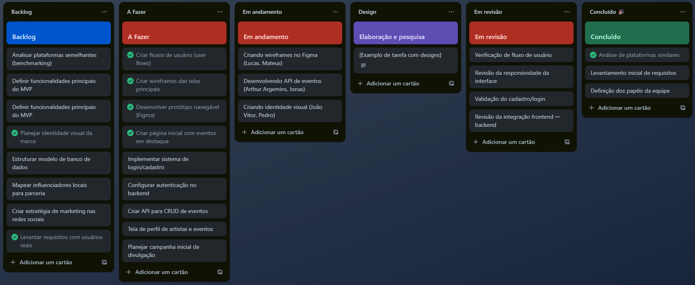

<!-- https://cdn.discordapp.com/attachments/1357321344102170774/1389034742913175732/image.png?ex=686326e9&is=6861d569&hm=ca6abb24c4bf77e4c61ce6c23817bde5141dfc2ce0038c25b385ca820654f358& -->

# Solução Implementada

A solução implementada do DivulgaHub reflete o progresso alcançado até o momento, destacando as funcionalidades de software desenvolvidas para atender às necessidades dos usuários e aos objetivos do projeto; Entre as principais entregas, destaca-se a funcionalidade de Exibição de Eventos, liderada por William, que permite aos usuários visualizar uma lista de eventos culturais, esportivos, sociais e corporativos de Belo Horizonte e região, com filtros por gênero e localização, garantindo uma experiência inicial acessível. Lucas Eduardo contribuiu com os Detalhes de Eventos, implementando páginas interativas que exibem informações específicas de cada evento, como título, local, data, gênero, preço e artistas, integrando um sistema de redirecionamento baseado em ID. João Tolentino desenvolveu o Cadastro de Usuário, oferecendo uma interface intuitiva para registro de novos usuários, enquanto Matheus Armani implementou o Cadastro de Eventos, possibilitando que organizadores insiram novos eventos de forma prática. Arthur Julio trabalhou no Cadastro de Artista, criando uma funcionalidade para artistas independentes cadastrarem seus perfis, e Jonas Pedrosa avançou nos Detalhes dos Artistas, detalhando informações como biografia e portfólio. Pedro Rocha iniciou o Mapa de Eventos, integrando uma visualização geográfica preliminar para localização dos eventos, e Arthur Chaves desenvolveu o Cadastro de Promotor, facilitando a inscrição de patrocinadores com dados básicos. A pesquisa de eventos, conduzida por João Heleno, forneceu a base de dados inicial, que foi consolidada em um arquivo JSON acessível via fetch, com suporte a favoritos e filtros dinâmicos. Essas funcionalidades, ainda em desenvolvimento, são testadas continuamente com foco em usabilidade e responsividade, utilizando Live Server no Visual Studio Code para validação, e estão alinhadas com os wireframes do Figma, garantindo uma base sólida para as próximas fases do projeto.

## Vídeo do Projeto

O vídeo a seguir traz uma apresentação do problema que a equipe está tratando e a proposta de solução (o video também está disponível no repositório na pasta files)

[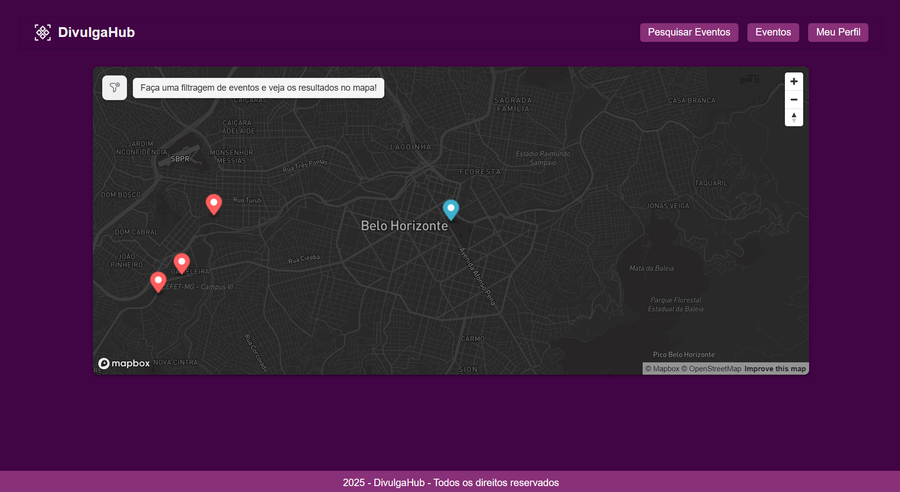](https://youtu.be/O-he5MjV428)

## Funcionalidades

Esta seção apresenta as funcionalidades da solução.Info

##### Funcionalidade - Cadastro evento

Permite a inclusão de novos eventos para o sistema

- **Estrutura de dados:** eventos
- **Instruções de acesso:**
  - Abra o site e cadastre os dados do evento
- **Tela da funcionalidade**:


##### Funcionalidade - Cadastro usuario

Permite a inclusão de novos usuários para o sistema

- **Estrutura de dados:** usuarios
- **Instruções de acesso:**
  - Abra o site e cadastre seus dados
- **Tela da funcionalidade**:


##### Funcionalidade - Cadastro artista

Permite a inclusão de novos artistas para o sistema

- **Estrutura de dados:** artistas
- **Instruções de acesso:**
  - Abra o site e cadastre os dados do artista
- **Tela da funcionalidade**:


##### Funcionalidade - Cadastro Promotor

Permite a inclusão de novos promotores para o sistema

- **Estrutura de dados:** promotores
- **Instruções de acesso:**
  - Abra o site e cadastre os dados do promotor
- **Tela da funcionalidade**:


##### Funcionalidade - Detalhes do Artista

Permite a visualização de detalhes de artistas no sistema

- **Estrutura de dados:** artistas
- **Instruções de acesso:**
  - Abra o site e veja os dados de um artista específico
- **Tela da funcionalidade**:

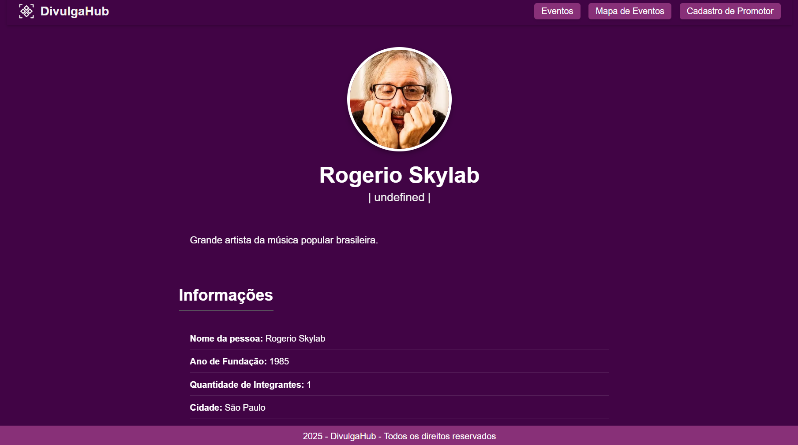

##### Funcionalidade - Detalhes do Evento

Permite a visualização de detalhes de um evento específico no sistema

- **Estrutura de dados:** eventos
- **Instruções de acesso:**
  - Abra o site e veja os dados de um evento específico, ao clicar no botão ver detalhes na página com todos os eventos (cards de eventos)
- **Tela da funcionalidade**:


##### Funcionalidade - Pesquisa de Eventos

Permite a pesquisa de eventos no sistema

- **Estrutura de dados:** eventos
- **Instruções de acesso:**
  - Abra o site e defina criterios para que a pesquisa seja feita
- **Tela da funcionalidade**:


##### Funcionalidade - Mapa de Eventos

Permite a visualização dos eventos pertos de você, assim como uma simples filtragem de eventos

- **Estrutura de dados:** eventos
- **Instruções de acesso:**
  - Abra o site e veja o mapa com os pins, representando os eventos
- **Tela da funcionalidade**:


##### Funcionalidade - Perfil usuário

Permite a visualização dos dados do usuário logado no sistema

- **Estrutura de dados:** usuarios
- **Instruções de acesso:**
  - Abra o site e veja seus dados já cadastrados
- **Tela da funcionalidade**:


## Estruturas de Dados

Descrição das estruturas de dados utilizadas na solução com exemplos no formato JSON.Info

##### Estrutura de Dados eventos

Eventos

```json
{
  "id": 1,
  "tipo": "musica",
  "categoria": "samba",
  "titulo": "Samba sob as Estrelas",
  "descricao": "Apresentação ao vivo de samba em espaço aberto.",
  "imagens": ["imagem1.png", "imagem2.png"],
  "data": "2025-06-15T20:00:00",
  "geolocalizacao": [],
  "local": {
    "estado": "Minas Gerais",
    "cidade": "Belo Horizonte",
    "endereco": "Av. Amazonas, 6200 - Gameleira"
  },
  "preco": 100,
  "idsArtistas": [1, 2]
}
```

##### Estrutura de Dados usuários

Registro dos usuários do sistema utilizados para login e para o perfil do sistema

```json
{
  "nome": "Ana Beatriz Costa",
  "telefone": "(11) 98765-4321",
  "cidade": "São Paulo",
  "email": "ana.costa@gmail.com",
  "genero": "Feminino"
}
```

##### Estrutura de Dados promotores

Registro dos promotores dos eventos

```json
{
  "nome": "Lucas Braga",
  "email": "lucasbraga@gmail.com",
  "nacionalidade": "Brasil",
  "tipo": "Individuo",
  "telefone": "(31) 12345-6789"
}
```

##### Estrutura de Dados artistas

Registro dos artistas dos eventos

```json
{
  "nomeArtistico": "",
  "descricao": "",
  "nomePessoa": "",
  "anoFundacao": "",
  "qtdIntegrantes": "",
  "cidade": "",
  "telefone": "",
  "genero": "",
  "generoArtistico": "",
  "foto": "",
  "spotify": "",
  "instagram": "",
  "youtube": "",
  "facebook": ""
}
```

## Módulos e APIs

Esta seção apresenta os módulos e APIs utilizados na solução

**Images**:

- randomuser.me - [https://randomuser.me](https://randomuser.me)

**Fonts:**

- Não foi usado

**Scripts:**

- jQuery - [http://www.jquery.com/](http://www.jquery.com/)
- Mapbox - [https://www.mapbox.com/](https://www.mapbox.com/)

# Referências

As referências utilizadas no trabalho foram:

- https://acordecultural.com.br/10-principais-problemas-na-producao-de-eventos-e-como-resolve-los/
- https://b612consultoria.com.br/quais-sao-os-desafios-comuns-na-realizacao-de-eventos-e-promocoes-locais/
